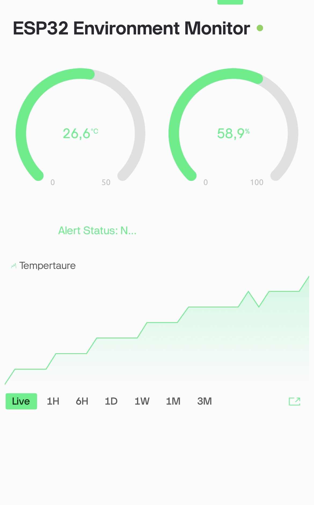
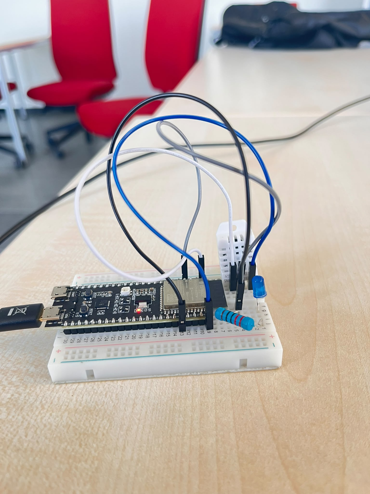
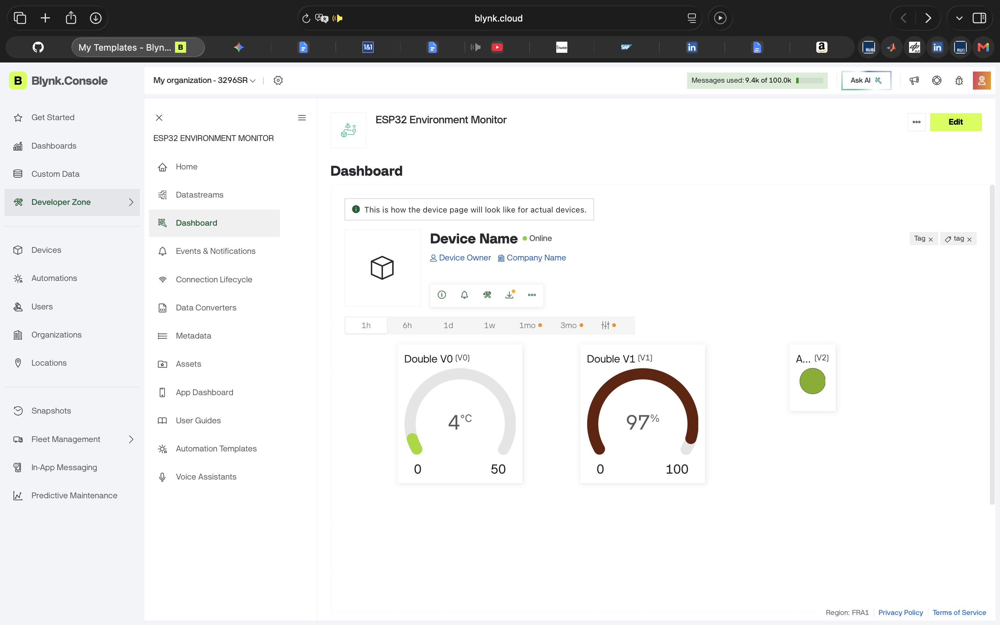
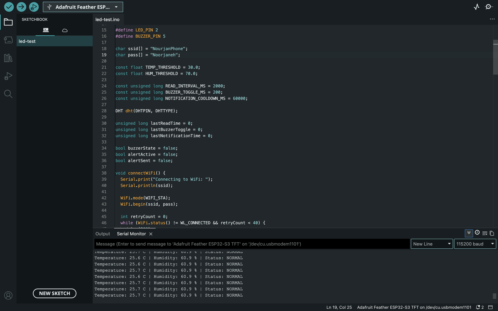

# ESP32 Environment Monitor

An ESP32-based environment monitoring system that measures temperature and humidity using a DHT22 sensor and sends real-time data to Blynk.

## Features

- Real-time temperature monitoring
- Real-time humidity monitoring
- Blynk dashboard integration
- LED alert indicator
- Buzzer alert output
- Push notification support through Blynk Events
- Threshold-based alert system

## Hardware Used

- ESP32
- DHT22 temperature and humidity sensor
- LED
- Buzzer
- Jumper wires
- Breadboard

## Pin Configuration

- DHT22 data pin: GPIO 4
- LED pin: GPIO 2
- Buzzer pin: GPIO 5

## Blynk Datastreams

- V0: Temperature
- V1: Humidity
- V2: Alert status
- V3: System status text

## Alert Conditions

The system triggers an alert when:

- Temperature is greater than or equal to 30.0 C
- Humidity is greater than or equal to 70.0%

When an alert is triggered:

- The LED turns on
- The buzzer pulses continuously
- A Blynk event notification is sent using `high_temp_alert`

## Project Structure

    esp32-environment-monitor/
    ├── esp32-environment-monitor.ino
    ├── README.md
    └── images/

## How It Works

1. The ESP32 connects to Wi-Fi.
2. The board connects to Blynk Cloud.
3. The DHT22 sensor is read every 2 seconds.
4. Temperature and humidity values are sent to Blynk.
5. If a threshold is exceeded, the system activates the alert outputs and sends a notification.

## Setup

1. Install the required Arduino libraries:
   - Blynk
   - DHT sensor library
2. Open `esp32-environment-monitor.ino` in Arduino IDE.
3. Replace the placeholder values in the code:
   - `YOUR_BLYNK_AUTH_TOKEN`
   - `YOUR_WIFI_SSID`
   - `YOUR_WIFI_PASSWORD`
4. Create the required datastreams in Blynk:
   - `V0` for temperature
   - `V1` for humidity
   - `V2` for alert state
   - `V3` for status text
5. Create a Blynk event with the code:
   - `high_temp_alert`
6. Upload the code to the ESP32.

## Serial Output Example

    Temperature: 29.4 C | Humidity: 52.1% | Status: NORMAL
    Temperature: 31.2 C | Humidity: 55.0% | Status: ALERT

## Notes

- The code includes a notification cooldown to avoid repeated alerts.
- The `.ino` file in this repository is prepared for public sharing, so Wi-Fi and Blynk credentials should stay as placeholders.

## Screenshots

## System Flowchart

### Mobile App Output

[

### Hardware Setup

### Blynk Dashboard

### Serial Output

## License

This project is provided for educational purposes.
